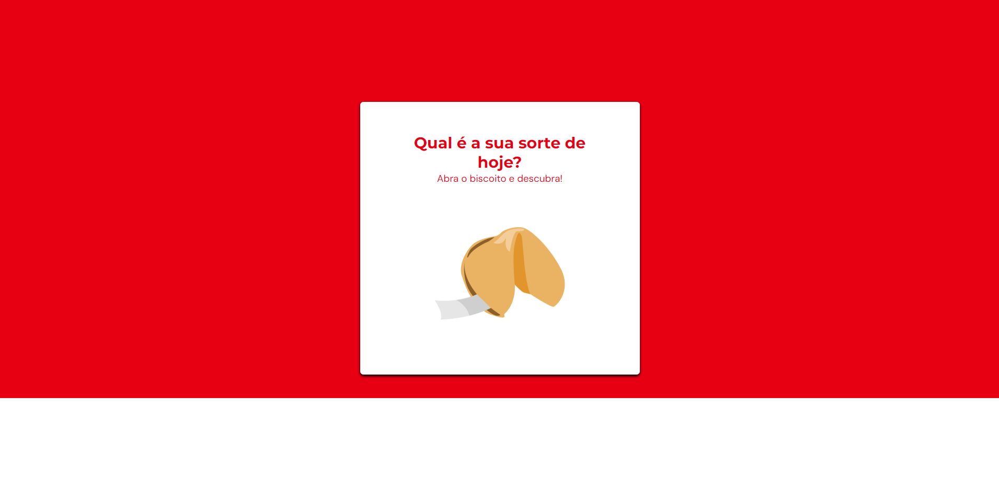
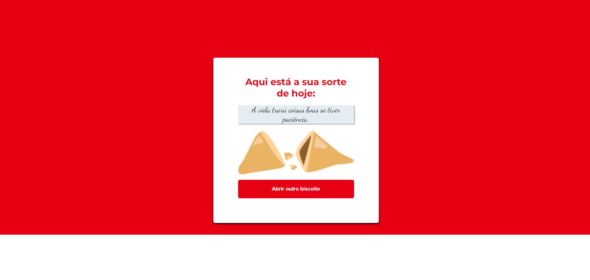

<h1 align="center"> Desafio Biscoito da sorte </h1>

Programa exclusivo do Bruno Bianchi, para ensino de tecnologias WEB.  
Desafio proposto pela Rocketseat, com objetivo de criar um jogo chamado Biscoito da Sorte, no qual o usuário, a partir de um clique ou enter, abre um biscoito com a sua sorte do dia, utilizando os seguintes recursos:

- Estrutura de dados HTML
- Animações com CSS
- Funções no Javascript
- Manipulação da DOM
- Biblioteca JS Math()
- Funções *callback*
- Arrays

  <a href="#-tecnologias">Tecnologias</a>&nbsp;&nbsp;&nbsp;|&nbsp;&nbsp;&nbsp;
  <a href="#-projeto">Projeto</a>

  

  
  

 

## 🚀 Tecnologias

Esse projeto foi desenvolvido com as seguintes tecnologias:

- HTML e CSS
- Javascript
- Git e Github

## 💻 Projeto

O Desafio é criar um jogo chamado Biscoito da Sorte utilizando alguns recursos específicos.

- [Acesse o projeto finalizado, online](https://brunobianchi13.github.io/Desafio-Biscoito-da-Sorte/)
- [Acesse o Layout no Figma](https://www.figma.com/file/n0Oc9hQgDoAdI6DlSDWNzp/Biscoito-da-Sorte-(Community)?node-id=0%3A1&mode=dev)

---

Feito by Bruno Bianchi

